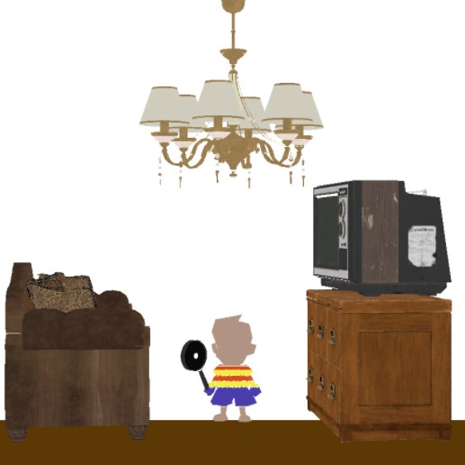

# proyecto1graficas
El objetivo de éste proyecto es demostrar los conocimientos adquiridos durante la primera mitad del curso.
Los estudiantes deben entregar un software que lea archivos obj y realice un render a archivos bmp. Creen una escena cargando varios modelos que muestre lo que han aprendido.

Escena recreada:

 
